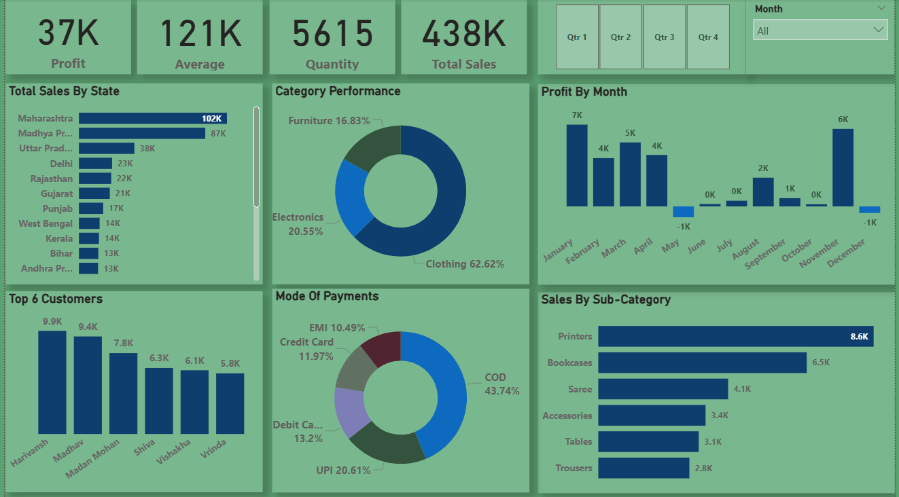

## 📊 E-Commerce Sales & Profit Dashboard | Power BI Project

## 📌 Project Overview

This Power BI project delivers an interactive E-Commerce Sales Analytics Dashboard built to monitor business performance across sales, profit, quantity, customer trends, and product categories.

The dashboard provides a complete overview of:

- Total Sales & Profit performance
- Category contribution analysis
- Monthly profit trends
- Top customers and best-selling products
- Payment mode distribution
- Regional sales performance by state

## 🎯 Project Objectives

The main goal of this project is to help stakeholders and business users:

* Track overall revenue and profit growth
* Identify top-performing states, customers, and sub-categories
* Understand category-wise sales distribution
* Analyze customer buying behavior and payment preferences 
* Detect monthly profit fluctuations and loss periods

## 📂 Dataset Information -->>>>

* **File Name:** :  Orders.csv, Details.csv

- <a href="https://github.com/dimple-shah-au13/E-Commerce-Sales-And-Profit-Dashboard/blob/main/Orders.csv">Orders Dataset</a>
- <a href="https://github.com/dimple-shah-au13/E-Commerce-Sales-And-Profit-Dashboard/blob/main/Details.csv">Details Dataset</a>

### Key Columns Included

|     Column Name         |     Description                                            |
| ------------------------|------------------------------------------------------------|
| **Order ID**            | Unique identifier for each customer order                  |
| **Order Date**          | Date when the order was placed                             |
| **Customer Name**       | Name of the customer who purchased the product             |
| **State**               | Customer’s state/location for regional sales analysis      |
| **Category**            | Product category (Clothing, Electronics, Furniture)        |
| **Sub-Category**        | Detailed product type (Printers, Saree, Bookcases, etc.)   |
| **Sales Amount**        | Total revenue generated from the order                     |
| **Quantity**            | Number of items purchased                                  |
| **Profit**              | Profit earned from the transaction                         |
| **Quarter**             | Quarter-wise grouping for time-based analysis              |
| **Month**               | Month name used for monthly profit trends                  |
| **Payment Mode**        | Payment type used (COD, UPI, Debit Card, Credit Card, EMI) |
| **Transaction Details** | Additional payment-related metadata                        |

## 🛠 Tools & Technologies Used

* **Power BI Desktop**
* **Power Query (ETL & Data Cleaning)**
* **DAX Measures (KPIs & Calculations)**
* Interactive Slicers & Drill-through
* Data Visualization & Data Modeling

## 🔑 Key Performance Indicators (KPIs)

KPI	                Value
* 💰 **Total Profit** :	37K
* 📊 **Average Sales** : 121K
* 📦 **Total Quantity Sold** : 5615
* 🛒 **Total Sales Amount** : 438K
* 📈 **Dashboard Visuals & Features**
* 🔹 **Total Sales by State** 

## 📌 New Calculated Columns

📌 AVG = 'Details'[TotalSales] / 'Details'[Quantity]

## 🧮 DAX Measures Used

📌 Profit = SUM(Details[Profit])
 
📌 Average = SUM(Details[AVG])

📌 Quantity = SUM(Details[Quantity])

📌 Total Sales = SUM(Details[TotalSales])

## 📈 Visual Insights

* Bar chart showing top revenue-generating states
* Maharashtra leads with 102K sales

## 🔹 Category Performance (Donut Chart)
- Contribution of major categories:
* Clothing – 62.62%
* Electronics – 20.55%
* Furniture – 16.83%

## 🔹 Profit by Month
- Monthly profit trend analysis:
* Highest profit in January (7K)
* Loss observed in May & December (-1K)

## 🔹 Top 6 Customers
- Highlights the most valuable customers based on purchases.

## 🔹 Mode of Payments
- Most used payment methods:
* COD – 43.74%
* UPI – 20.61%
* Debit Card – 13.2%

## 🔹 Sales by Sub-Category
- Top sub-category products:
* Printers – 8.6K
* Bookcases – 6.5K
* Saree – 4.1K

## 🎛 Interactive Filters Included

* Quarter Selection (Qtr1 – Qtr4)
* Month Dropdown Filter
* These allow users to explore performance across different time periods.

## 📷 Dashboard Interaction -->>>>

🔗 <a href="https://github.com/dimple-shah-au13/E-Commerce-Sales-And-Profit-Dashboard/blob/main/Ecommerce-Dashboard.pbix">View E-Commerce Sales & Profit Dashboard</a>

⚠️ Note: This dashboard file must be opened using **Microsoft Power BI Desktop** by clicking on View raw.

## 🧠 Business Insights Derived

* Clothing dominates overall revenue contribution
* COD remains the most preferred payment method
* Maharashtra is the highest-performing state
* Seasonal losses appear in May and December
* Printers and Bookcases are top-selling subcategories

## 🚀 How to Use This Project

1. Download the .pbix file from this repository
2. Open it using Power BI Desktop
3. Refresh the dataset if needed
4. Interact with slicers and visuals for insights

## 📷 Dashboard Preview

Here’s a preview of the interactive dashboard:

## 👩‍💻 Author

**Dimple Shah**
-  Data Analyst | Excel | Power BI | Tableau | SQL | Python | Business Intelligence Enthusiast

## GITHUB -->>>>

🔗 <a href ="https://github.com/dimple-shah-au13/E-Commerce-Sales-And-Profit-Dashboard/tree/main">GITHUB</a>

## ⭐ Support

If you found this project helpful, don’t forget to ⭐ star the repository on GitHub!
